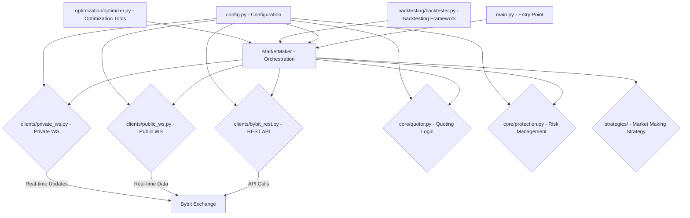

# Algobots/marketmaker - Bybit Market Making Bot (GEMINI.md)

This document provides a comprehensive overview of the `Algobots/marketmaker` project, detailing its architecture, components, technical considerations, and development roadmap. It is intended for AI agents and developers seeking an in-depth understanding of the project.

## 1. Project Overview

The `Algobots/marketmaker` project is a sophisticated suite of Python tools designed for automated market making on the Bybit exchange. It aims to provide a robust, configurable, and optimizable framework for deploying market-making strategies, leveraging real-time data and advanced backtesting capabilities.

**Key Objectives:**
-   Implement efficient and reliable market-making strategies.
-   Provide a flexible and extensible architecture for strategy development and testing.
-   Enable comprehensive backtesting and hyperparameter optimization.
-   Ensure high precision in financial calculations.
-   Maintain robust connectivity and error handling with the Bybit V5 API.

## 2. Architecture

The project follows a modular architecture, with distinct components handling specific responsibilities. The core `MarketMaker` orchestrates these components.

**Core Components:**

### 2.1. `main.py`
-   **Role**: The primary entry point for the bot. It initializes the `MarketMaker` and determines whether to run in live mode (with WebSockets) or backtest mode.

### 2.2. `market_maker.py` (Consolidated)
-   **Role**: The central orchestrator of the market-making operations. It connects all sub-components and runs the main loop for quoting, order management, and protection.
-   **Key Responsibilities**:
    -   Initialize and manage `BybitRest`, `PublicWS`, `PrivateWS` clients.
    -   Utilize `Quoter` to compute and place optimal bid/ask orders.
    -   Employ `Protection` for risk management (e.g., trailing stop-loss).
    -   Integrate with a specific `MarketMakingStrategy` to adapt behavior.

### 2.3. `clients/` (e.g., `bybit_rest.py`, `public_ws.py`, `private_ws.py`)
-   **Role**: Encapsulates all interactions with the Bybit V5 API.
-   **`bybit_rest.py`**: Handles HTTP REST API calls (e.g., fetching instrument info, placing/amending/canceling orders).
-   **`public_ws.py`**: Manages public WebSocket connections for real-time market data (order book, klines).
-   **`private_ws.py`**: Manages private WebSocket connections for real-time updates on positions, orders, and executions.

### 2.4. `core/` (e.g., `quoter.py`, `protection.py`)
-   **Role**: Contains core market-making logic.
-   **`quoter.py`**: Computes optimal bid and ask prices based on configured spreads, market conditions, and inventory. Responsible for placing and managing limit orders.
-   **`protection.py`**: Implements risk management strategies, such as trailing stop-loss and break-even stop-loss, activating based on position PnL.

### 2.5. `strategies/`
-   **Role**: Houses different market-making strategy implementations. These strategies define how quotes are generated and positions are managed based on various market conditions.

### 2.6. `config.py`
-   **Role**: Defines all configurable parameters for the bot. It loads settings from environment variables and uses Python `dataclasses` for structured configuration.
-   **Key Features**:
    -   API settings (`API_KEY`, `API_SECRET`, `TESTNET`).
    -   Trading parameters (`SYMBOL`, `CATEGORY`).
    -   Market-making parameters (`BASE_SPREAD_BPS`, `QUOTE_SIZE`, `REPLACE_THRESHOLD_TICKS`).
    -   Risk parameters (`MAX_POSITION`, `PROTECT_MODE`).
    -   Backtester settings.

### 2.7. `backtesting/` (e.g., `backtester.py`, `fill_engine.py`, `historical_data.py`)
-   **Role**: Provides a robust framework for backtesting the `MarketMaker` bot.
-   **`backtester.py`**: Orchestrates the backtesting process, running the `MarketMaker` logic over historical data and calculating performance metrics.
-   **`fill_engine.py`**: Simulates order fills within historical candles, considering price paths and volume capacity.
-   **`historical_data.py`**: Fetches and manages historical kline data from Bybit.

### 2.8. `optimization/` (e.g., `optimizer.py`, `profit_optimizer.py`)
-   **Role**: Contains tools for hyperparameter optimization of the market maker bot.
-   Utilizes libraries like `optuna` to suggest and test various parameter combinations, optimizing for metrics like net PnL or Sharpe ratio.

### 2.9. `statistics.py`
-   **Role**: Provides functionality to calculate and display various trading statistics.

## 3. Key Technologies

-   **Python 3.8+**: Primary development language.
-   **`pybit`**: Python client for Bybit V5 API.
-   **`pandas`, `numpy`**: For data manipulation and numerical operations.
-   **`optuna`**: For hyperparameter optimization.
-   **`python-dotenv`**: For loading environment variables.
-   **`asyncio`**: For asynchronous operations, especially with WebSockets.
-   **`dataclasses`**: For structured configuration.
-   **`pytest`**: Python testing framework.
-   **`unittest.mock`**: For mocking dependencies in tests.

## 4. Current Status & TODOs

The project is functional but has significant areas for improvement, as detailed in `Algobots/marketmaker/TODO.txt`. Key areas include:

-   **Consolidation**: Merging numerous `market_maker` variants into a single, modular codebase.
-   **Refactoring**: Extracting core components into dedicated modules (`clients/`, `core/`, `strategies/`).
-   **Configuration**: Unifying configuration management into a single, robust system.
-   **Testing**: Expanding unit and integration test coverage for all new and refactored components.
-   **Error Handling**: Enhancing API error handling and implementing retry logic.
-   **Documentation**: Improving docstrings and type hinting across the codebase.

Refer to `Algobots/marketmaker/TODO.txt` for a detailed list of tasks and code snippets.

## 5. Testing Strategy

-   **Unit Tests**: Located in `Algobots/marketmaker/tests/`. Uses `pytest` and `unittest.mock` to test individual modules in isolation (e.g., `bybit_rest.py`, `quoter.py`, `fill_engine.py`). Mocks external dependencies (like `pybit` API calls) to ensure tests are fast and reliable.
-   **Integration Tests**: Planned tests will simulate interactions between core components (e.g., `MarketMaker` with `Quoter` and `Protection`), mocking only the external Bybit API layer.
-   **Backtesting Validation**: The backtesting framework itself serves as a form of integration testing for strategies against historical data.

## 6. Adherence to Pyrmethus's Codex

This project strives to align with the principles outlined in Pyrmethus's Expanded Codex:

-   **Readability & Maintainability**: Strong emphasis on type hinting, comprehensive docstrings, and consistent naming conventions. The consolidation efforts directly address code duplication.
-   **Robustness & Error Handling**: Focus on granular API error handling, retry mechanisms, and graceful shutdowns. Consistent use of `Decimal` for financial calculations is a core tenet.
-   **Modularity & Reusability**: The refactoring plan prioritizes extracting components into separate modules with clear API boundaries, promoting dependency injection.
-   **Efficiency & Performance**: Backtesting performance is a consideration, with potential for `numba` integration. Optimization tools are central to the project.
-   **Security**: API keys are loaded from environment variables, adhering to best practices.
-   **Testing**: A dedicated `tests` directory and `pytest` setup are in place, with a clear roadmap for expanded test coverage.

This `GEMINI.md` will be updated as the project evolves, reflecting new features, architectural changes, and completed tasks from the `TODO.txt`.