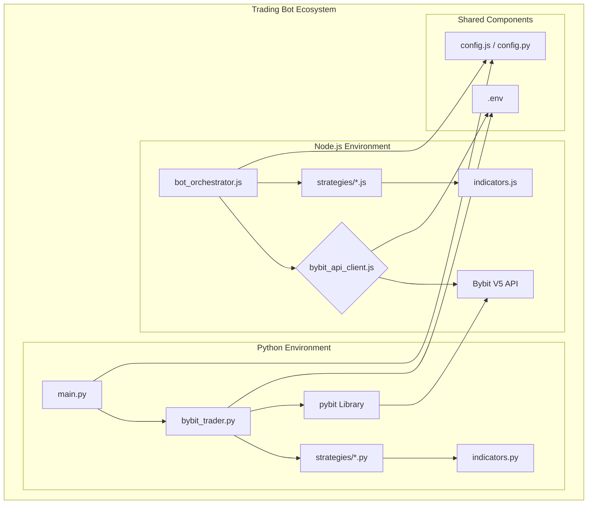

# Architecture and Design Decisions

This document provides a detailed overview of the trading bot's architecture, its components, and the key design decisions behind its implementation.

## High-Level Architecture

The system is composed of two main environments: a Node.js environment and a Python environment. Both are designed to run trading bots independently but share a common purpose of interacting with the Bybit V5 API.

## Component Breakdown

### Node.js Environment

*   **`bot_orchestrator.js`**: The main entry point for the Node.js bots. It reads the configuration and dynamically loads and runs the enabled strategies.
*   **`bybit_api_client.js`**: A custom-built, robust client for interacting with the Bybit V5 REST API. It includes features like automatic retries with exponential backoff and a dry-run mode for simulations.
*   **`strategies/*.js`**: A directory containing individual trading strategy modules. Each strategy is a self-contained module that can be easily enabled or disabled via configuration.
*   **`indicators.js`**: A library of technical indicator calculations used by the Node.js strategies.
*   **`logger.js`**: A centralized logging system using `winston` for structured and colored log output.

### Python Environment

*   **`main.py`**: The main entry point for the Python bots. It initializes the `BybitTrader` with a specified strategy.
*   **`bybit_trader.py`**: The core of the Python bot. It handles the WebSocket connection, strategy execution, and order management.
*   **`strategies/*.py`**: A directory for Python-based trading strategies. Similar to the Node.js environment, these are modular and can be dynamically loaded.
*   **`indicators.py`**: A Python library for technical indicator calculations.
*   **`pybit` library**: The official Bybit Python SDK used for all API interactions.

## Design Decisions

### Dual Language Approach

The use of both Python and Node.js allows for flexibility and leverages the strengths of each ecosystem:

*   **Python:** Widely used in the quantitative finance and data science communities, with a rich ecosystem of libraries for numerical computing and machine learning (e.g., `pandas`, `pandas_ta`).
*   **Node.js:** Excels at handling I/O-bound operations and real-time applications, making it a great choice for managing WebSocket connections and concurrent API requests.

### Modular Strategies

Strategies are designed as independent, plug-and-play modules. This design decision offers several advantages:

*   **Scalability:** New strategies can be added without modifying the core bot logic.
*   **Maintainability:** Strategies can be developed, tested, and debugged in isolation.
*   **Flexibility:** Users can easily enable or disable strategies through configuration, allowing for dynamic trading setups.

### Configuration Management

Configuration is externalized from the code, allowing for easy adjustments without code changes:

*   **`.env`**: Used for storing sensitive API credentials, ensuring they are not hardcoded in the source code.
*   **`config.js` / `config.py`**: These files define the operational parameters of the bots, such as which strategies to run, their parameters, and other settings.

### Error Handling and Retries

The Node.js `bybit_api_client.js` implements a robust retry mechanism for API calls. This is a critical design decision for a trading bot, as it provides resilience against transient network issues and API-side errors, preventing the bot from crashing due to temporary failures.

### Dry Run Mode

A `DRY_RUN` flag is available in the configuration. When enabled, the bot simulates trades without executing them on the exchange. This is an essential feature for:

*   **Strategy Testing:** Validating new strategies with live market data without risking capital.
*   **Debugging:** Safely testing the bot's logic and order placement functionality.

## Data Flow

The data flow for real-time trading is as follows:

1.  **Connection:** The bot establishes a WebSocket connection to the Bybit V5 API.
2.  **Subscription:** It subscribes to the kline (candlestick) stream for the configured trading pairs.
3.  **Data Ingestion:** The bot receives real-time kline data through the WebSocket.
4.  **Indicator Calculation:** The incoming data is used to update technical indicators.
5.  **Signal Generation:** The loaded strategy processes the indicator values to generate `buy`, `sell`, or `hold` signals.
6.  **Order Execution:** If a `buy` or `sell` signal is generated, the bot places a market order through the REST API.
7.  **State Management:** The bot updates its internal state to track open positions and other relevant information.
