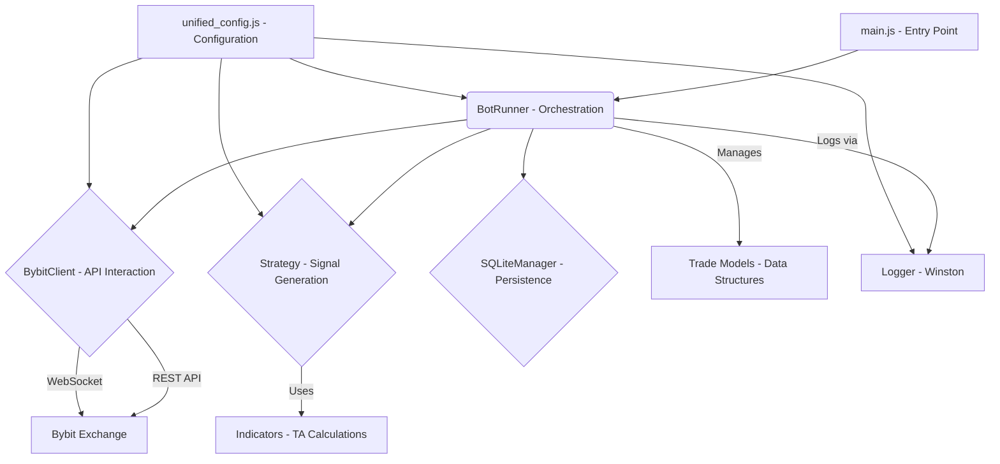

# Pybit JavaScript Scalper Bot - GEMINI.md

This document serves as a comprehensive guide for the Pybit JavaScript Scalper Bot, detailing its architecture, components, technical considerations, and development roadmap. It is intended for AI agents and developers seeking an in-depth understanding of the project.

## 1. Project Overview

The Pybit JavaScript Scalper Bot is an automated trading system designed for the Bybit exchange, specifically targeting scalping strategies on perpetual futures. Developed in Node.js, it emphasizes precision, robustness, and modularity to facilitate rapid iteration and strategy development.

**Key Objectives:**
- Execute high-frequency trading strategies with minimal latency.
- Ensure financial calculation accuracy using `Decimal.js`.
- Provide a flexible framework for integrating diverse technical analysis indicators and trading strategies.
- Maintain robust connectivity and error handling with the Bybit V5 API.
- Offer comprehensive logging and state management for operational transparency and resilience.

## 2. Architecture

The bot follows a modular, event-driven architecture, separating concerns into distinct components:

**Core Components:**

### 2.1. `main.js`
- **Role**: The primary entry point of the application. It initializes the `BotRunner` and handles critical startup checks (e.g., API key validation) and global error catching.

### 2.2. `core/bot_runner.js`
- **Role**: The central orchestrator of the bot. It manages the main trading loop, coordinates interactions between `BybitClient`, `Strategy`, and `SQLiteManager`, and implements core risk management features like emergency stops and position reconciliation.
- **Key Responsibilities**:
    - Initialize `BybitClient`, `SQLiteManager`, and the selected `Strategy`.
    - Execute the main `run()` loop, performing periodic checks and actions.
    - Implement `_emergencyStop()` to halt trading based on equity drawdown.
    - Handle `_reconcilePositions()` to synchronize local database state with exchange positions.
    - Manage `_manageTradeExit()` for active trades based on strategy-defined exit conditions.
    - Trigger signal generation from the active strategy and execute orders.

### 2.3. `clients/bybit_client.js`
- **Role**: Encapsulates all interactions with the Bybit V5 API (both REST and WebSocket).
- **Key Responsibilities**:
    - Initialize `RestClientV5` and `WebsocketClient` from `bybit-api`.
    - Provide methods for fetching klines, wallet balance, placing/canceling/amending orders, and managing positions (e.g., `closePosition`, `setLeverage`, `setTradingStop`).
    - Manage WebSocket connections for real-time kline data updates, including reconnection logic.
    - Implement dry-run functionality to simulate API calls without actual execution.

### 2.4. `strategies/` (e.g., `ehlers_supertrend_strategy.js`, `chanexit_strategy.js`, `market_maker_strategy.js`)
- **Role**: Contains the implementation of various trading strategies. Each strategy is designed to be pluggable into the `BotRunner`.
- **Key Responsibilities**:
    - `buildIndicators(klines)`: Processes raw kline data and attaches calculated technical indicators.
    - `generateSignals(klines)`: Analyzes indicator data to produce trading signals (`Buy`, `Sell`, `none`), along with calculated Stop-Loss (SL) and Take-Profit (TP) prices.
    - Strategies are responsible for their specific logic, risk calculation, and entry/exit conditions.

### 2.5. `indicators/indicators.js`
- **Role**: Provides a centralized library for calculating various technical analysis indicators.
- **Key Responsibilities**:
    - Implement `Decimal.js`-compatible versions of common indicators (EMA, SMA, ATR, RSI, Fisher Transform, Ehlers Supertrend, ADX, etc.).
    - Ensure all calculations maintain high precision.
    - Used by strategy modules to enrich kline data.

### 2.6. `persistence/sqlite_manager.js`
- **Role**: Manages interaction with the SQLite database for persisting bot state, trades, and positions.
- **Key Responsibilities**:
    - Initialize the SQLite database and create necessary tables.
    - Provide methods for adding, retrieving, and updating trade records.
    - Ensures bot state can be recovered across restarts.

### 2.7. `config/unified_config.js`
- **Role**: A single source of truth for all bot configurations, including API credentials, trading parameters, risk management settings, and strategy-specific parameters.
- **Key Features**:
    - Loads sensitive API keys from environment variables (`.env`).
    - Supports global dry-run mode.
    - Centralizes parameters for easy management and modification.
    - Includes logic to convert string-represented numbers to actual `Decimal.js` objects.

### 2.8. `utils/logger.js`
- **Role**: Configures and provides a Winston-based logging instance for the entire application.
- **Key Features**:
    - Supports multiple log levels (`DEBUG`, `INFO`, `WARNING`, `ERROR`, `CRITICAL`).
    - Outputs to console (color-coded with `chalk`) and daily rotating log files.
    - Implements sensitive data filtering for API keys in logs.

### 2.9. `models/trade_models.js`
- **Role**: Defines data models for `Trade` and `Position` objects, ensuring consistent data structures throughout the application, particularly when interacting with the database.

## 3. Key Technologies

- **Node.js**: Asynchronous JavaScript runtime.
- **`bybit-api`**: Official Bybit V5 API client library.
- **`Decimal.js`**: Arbitrary-precision decimal arithmetic library, crucial for financial calculations.
- **`winston` & `winston-daily-rotate-file`**: Robust logging framework.
- **`chalk`**: Terminal string styling for enhanced log readability.
- **`sqlite` & `sqlite3`**: Lightweight, file-based SQL database for persistence.
- **`moment-timezone`**: For robust time handling and timezone conversions.
- **`technicalindicators`**: A JavaScript library for technical analysis indicators (used alongside custom `Decimal.js` implementations).
- **`jest`**: JavaScript testing framework.

## 4. Current Status & TODOs

The project is functional but has significant areas for improvement, as detailed in `pybit/javabot/TODO.txt`. Key areas include:

- **Refactoring**: Consolidating bot versions, extracting common utilities, and improving modularity.
- **Robustness**: Enhancing API error handling, implementing retry logic, circuit breakers, and graceful shutdowns.
- **Precision**: Dynamic fetching of exchange precision for orders.
- **Testing**: Expanding unit and integration test coverage.
- **Documentation**: Comprehensive JSDoc comments.

Refer to `pybit/javabot/TODO.txt` for a detailed list of tasks and code snippets.

## 5. Testing Strategy

- **Unit Tests**: Located in `pybit/javabot/__tests__/`. Uses `jest` for isolated testing of individual modules (e.g., `indicators.js`, `bybit_client.js`, `utils.js`, `sqlite_manager.js`). Mocks external dependencies (like `bybit-api` and `sqlite`) to ensure tests are fast and reliable.
- **Integration Tests (Planned)**: Future tests will simulate end-to-end bot operations with mocked external services to verify component interactions.

## 6. Adherence to Pyrmethus's Codex

This project strives to align with the principles outlined in Pyrmethus's Expanded Codex:

- **Readability & Maintainability**: Emphasis on consistent naming, JSDoc, and code formatting (via ESLint).
- **Robustness & Error Handling**: Focus on specific exception handling, retry mechanisms, resource cleanup, and data validation.
- **Modularity & Reusability**: Components are designed with separation of concerns (e.g., `BybitClient`, `Strategy`, `SQLiteManager`). Further refactoring is planned to enhance this.
- **Efficiency & Performance**: Asynchronous operations are utilized, and `Decimal.js` ensures precision without sacrificing too much performance for critical calculations.
- **Security**: API keys are loaded from environment variables, and sensitive data is filtered from logs.
- **Testing**: A dedicated `__tests__` directory and `jest` configuration are in place, with plans for expanded test coverage.

This `GEMINI.md` will be updated as the project evolves, reflecting new features, architectural changes, and completed tasks from the `TODO.txt`.
