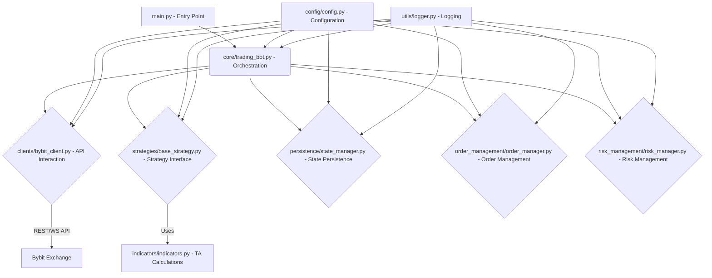

# Pybit Algobots: Unified Supertrend Trading Bot (GEMINI.md)

This document provides a comprehensive overview of the `pybitbot` project, detailing its architecture, components, technical considerations, and development roadmap. It is intended for AI agents and developers seeking an in-depth understanding of the project.

## 1. Project Overview

The `pybitbot` project is undergoing a significant refactoring effort to consolidate multiple Python-based Supertrend trading bot versions into a single, unified, and highly modular system. The primary goal is to create a robust, asynchronous, and extensible framework for automated scalping strategies on the Bybit exchange.

**Key Objectives:**
-   **Unification**: Merge fragmented bot implementations into a cohesive codebase.
-   **Modularity**: Separate concerns into distinct, reusable components (API clients, strategies, risk management, persistence).
-   **Robustness**: Enhance error handling, implement retry mechanisms, and improve WebSocket stability.
-   **Precision**: Ensure all financial calculations are performed with high accuracy using Python's `decimal.Decimal`.
-   **Testability**: Design components for easy unit and integration testing.
-   **Extensibility**: Provide a clear framework for adding new strategies or features.

## 2. Architecture

The refactored architecture will follow a layered, modular design, with a central `TradingBot` orchestrating interactions between various components.

**Core Components (Post-Refactoring):**

### 2.1. `main.py`
-   **Role**: The primary entry point of the unified bot. It will initialize the `Config`, select the active strategy, and instantiate and run the `TradingBot`.

### 2.2. `core/trading_bot.py`
-   **Role**: The central orchestrator of the bot's operations. It manages the main trading loop, coordinates data flow, and delegates tasks to specialized modules.
-   **Key Responsibilities**:
    -   Initialize and manage instances of `BybitClient`, `BotStateManager`, `OrderManager`, `RiskManager`, and the selected `Strategy`.
    -   Fetch market data (klines) and pass it to the active strategy.
    -   Receive signals from the strategy and trigger order execution via `OrderManager`.
    -   Periodically save bot state via `BotStateManager`.
    -   Apply global risk checks via `RiskManager`.

### 2.3. `clients/bybit_client.py`
-   **Role**: Encapsulates all interactions with the Bybit V5 API (both REST and WebSocket).
-   **Key Responsibilities**:
    -   Handle API authentication and request signing.
    -   Provide methods for fetching klines, wallet balance, instrument info, etc.
    -   Manage WebSocket connections for real-time market data and account updates, including robust reconnection logic and error handling.
    -   Implement retry mechanisms for transient API errors.

### 2.4. `strategies/` (e.g., `base_strategy.py`, `ehlers_supertrend.py`, `simple_supertrend.py`)
-   **Role**: Contains the implementation of various trading strategies. Each strategy adheres to a `BaseStrategy` interface.
-   **Key Responsibilities**:
    -   `calculate_indicators(klines)`: Processes raw kline data and attaches calculated technical indicators.
    -   `generate_signal(klines)`: Analyzes indicator data to produce trading signals (`buy`, `sell`, `none`), along with calculated Stop-Loss (SL) and Take-Profit (TP) prices.

### 2.5. `indicators/indicators.py`
-   **Role**: Provides a centralized library for calculating various technical analysis indicators.
-   **Key Responsibilities**:
    -   Implement `decimal.Decimal`-compatible versions of common indicators (EMA, SMA, ATR, RSI, Fisher Transform, Ehlers Supertrend, etc.).
    -   Ensure all calculations maintain high precision.

### 2.6. `persistence/state_manager.py`
-   **Role**: Manages the persistence and recovery of the bot's operational state (e.g., open positions, last signal, PnL).
-   **Key Responsibilities**:
    -   Load and save bot state (e.g., using `pickle` for `bot_state.pkl` or a database).
    -   Ensure data integrity during state transitions.

### 2.7. `order_management/order_manager.py`
-   **Role**: Handles all aspects of order placement, modification, and cancellation.
-   **Key Responsibilities**:
    -   Interface with `BybitClient` to execute trade orders.
    -   Manage order types (market, limit, conditional) and parameters (SL, TP, reduce-only).
    -   Handle order precision and quantity rounding.

### 2.8. `risk_management/risk_manager.py`
-   **Role**: Implements the bot's risk control mechanisms.
-   **Key Responsibilities**:
    -   Calculate position sizing based on defined risk per trade.
    -   Implement emergency stop logic (e.g., based on overall equity drawdown).
    -   Manage trailing stops and break-even adjustments for open positions.

### 2.9. `config/config.py`
-   **Role**: A single, centralized source of truth for all bot configurations.
-   **Key Features**:
    -   Uses Python `dataclasses` for structured and type-hinted configuration.
    -   Loads sensitive API keys from environment variables (`.env`).
    -   Defines global bot settings, API parameters, and strategy-specific parameters.

### 2.10. `utils/` (e.g., `logger.py`, `helpers.py`)
-   **Role**: Provides common utility functions.
-   **`logger.py`**: Configures and provides a standardized logging interface.
-   **`helpers.py`**: Contains general utility functions (e.g., mathematical helpers, time conversions).

## 3. Key Technologies

-   **Python 3.8+**: Primary development language.
-   **`pybit`**: Python client for Bybit V5 API.
-   **`asyncio`**: For asynchronous programming and managing concurrent operations.
-   **`decimal`**: Python's built-in module for arbitrary-precision decimal arithmetic.
-   **`dataclasses`**: For structured and type-hinted configuration.
-   **`python-dotenv`**: For loading environment variables.
-   **`tenacity`**: For robust retry logic.
-   **`pytest` & `pytest-asyncio`**: For comprehensive unit and integration testing.
-   **`unittest.mock`**: For mocking dependencies in tests.

## 4. Current Status & TODOs

The `pybitbot` project is currently undergoing a significant refactoring and consolidation. The existing codebase contains multiple bot versions, which are being merged into the unified architecture described above. Key development areas are detailed in `pybitbot/TODO.txt`.

**Key Areas of Focus:**
-   **Code Consolidation**: Merging fragmented bot implementations into a single, modular system.
-   **Module Extraction**: Creating dedicated modules for clients, risk management, order management, and persistence.
-   **Testing**: Expanding unit and integration test coverage for all new and refactored components.
-   **Error Handling**: Implementing more granular API error handling and robust retry mechanisms.
-   **Documentation**: Adding comprehensive type hints and docstrings.

Refer to `pybitbot/TODO.txt` for a detailed, actionable list of tasks and code snippets.

## 5. Testing Strategy

-   **Unit Tests**: Located in `pybitbot/tests/`. Uses `pytest` and `unittest.mock` to test individual modules in isolation (e.g., `bybit_client.py`, `order_manager.py`, `risk_manager.py`, `state_manager.py`, and all strategy implementations). External dependencies like `pybit` API calls are mocked to ensure tests are fast and reliable.
-   **Integration Tests**: Will simulate end-to-end bot operations, interacting with mocked Bybit API responses and an in-memory database (if applicable) to verify the interaction between different modules.
-   **Test-Driven Development (TDD)**: Encouraged for new feature development and refactoring efforts.

## 6. Adherence to Pyrmethus's Codex

This project is committed to adhering to the advanced principles of good coding practice outlined in Pyrmethus's Expanded Codex:

-   **Readability & Maintainability**: Strong emphasis on comprehensive type hinting, clear docstrings, consistent PEP 8 naming conventions, and refactoring complex logic into smaller, readable units.
-   **Robustness & Error Handling**: Implementing granular API error handling, `tenacity`-based retry mechanisms, graceful shutdowns, and consistent use of `decimal.Decimal` for financial accuracy.
-   **Modularity & Reusability**: The core refactoring effort is centered around extracting components into separate, reusable modules with well-defined interfaces, promoting dependency injection.
-   **Efficiency & Performance**: Leveraging `asyncio` for non-blocking I/O operations to ensure high performance suitable for scalping strategies.
-   **Security**: API keys are loaded from environment variables, and sensitive information is handled securely.
-   **Testing**: A robust testing framework with `pytest` is being established, with a focus on extensive unit and integration test coverage to ensure code quality and reliability.

This `GEMINI.md` will be updated regularly to reflect the project's progress, architectural changes, and completed tasks from the `TODO.txt`.